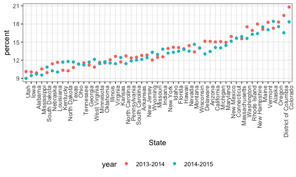

strings\_and\_factors
================
Priyal
10/16/2018

Tidyverse automatically loads packages: ggplot2, tibble, tidyr, readr, purr, dplyr, stringr and forcats.

### Regex

``` r
string_vec1 = c("my", "name", "is", "jeff")
str_detect(string_vec1, "jeff")
```

    ## [1] FALSE FALSE FALSE  TRUE

``` r
str_replace(string_vec1, "jeff", "Jeff")
```

    ## [1] "my"   "name" "is"   "Jeff"

It is basically scanning through to look for "jeff". str\_detect is case sensitive.

str\_replace will scan to look for "jeff" and replace it with "Jeff"

``` r
string_vec2 = c(
  "i think we all rule for participating",
  "i think i have been caught",
  "i think this will be quite fun actually",
  "it will be fun, i think"
  )
str_detect(string_vec2, "i think")
```

    ## [1] TRUE TRUE TRUE TRUE

``` r
str_detect(string_vec2, "^i think")
```

    ## [1]  TRUE  TRUE  TRUE FALSE

``` r
str_detect(string_vec2, "i think$")
```

    ## [1] FALSE FALSE FALSE  TRUE

^ represents --&gt; begin with $ represents ---&gt; end with

``` r
string_vec3 = c(
  "Y'all remember Pres. HW Bush?",
  "I saw a green bush",
  "BBQ and Bushwalking at Molonglo Gorge",
  "BUSH!!"
  )

str_detect(string_vec3,"[Bb]ush")
```

    ## [1]  TRUE  TRUE  TRUE FALSE

Using the square bracket; multiple options for the match were given; B or b

``` r
string_vec4 = c(
  '7th inning stretch',
  '1st half soon to begin. Texas won the toss.',
  'she is 5 feet 4 inches tall',
  '3AM - cant sleep :('
  )

str_detect(string_vec4,"[0-9][a-zA-Z]")
```

    ## [1]  TRUE  TRUE FALSE  TRUE

Giving a range of values in the square bracket. str-detect now scans for numbers ranging from 0 to 9 followed by a-z or A-Z.

``` r
string_vec5 = c(
  'Its 7:11 in the evening',
  'want to go to 7-11?',
  'my flight is AA711',
  'NetBios: scanning ip 203.167.114.66'
  )

str_detect(string_vec5, "7.11")
```

    ## [1]  TRUE  TRUE FALSE  TRUE

. can match anything. Here the third example didn't match as there was nothing between 7 and 11.

Dealing with special characters

``` r
string_vec6 = c(
  'The CI is [2, 5]',
  ':-]',
  ':-[',
  'I found the answer on pages [6-7]'
  )

str_detect(string_vec6, "\\[")
```

    ## [1]  TRUE FALSE  TRUE  TRUE

If we want to search for \[ and \], ( and ), and . we have to indicate it is special with `\`, but `\` itself is special so we have to put `\\[`

### PULSE data

Tidying the Pulse dataset

``` r
pulse_data = haven::read_sas("./data/public_pulse_data.sas7bdat") %>%
  janitor::clean_names() %>%
  gather(key = visit, value = bdi, bdi_score_bl:bdi_score_12m) %>%
  mutate(visit = str_replace(visit, "bdi_score_", ""),
         visit = str_replace(visit, "bl", "00m"), 
         visit = fct_relevel(visit, str_c(c("00", "01", "06", "12"), "m"))) %>% 
  arrange(id, visit)
```

    ## Warning: attributes are not identical across measure variables;
    ## they will be dropped

### NSDUH data

``` r
url = "http://samhda.s3-us-gov-west-1.amazonaws.com/s3fs-public/field-uploads/2k15StateFiles/NSDUHsaeShortTermCHG2015.htm"
drug_use_xml = read_html(url)

table_marj = (drug_use_xml %>% html_nodes(css = "table")) %>% 
  .[[1]] %>%
  html_table() %>%
  slice(-1) %>%
  as_tibble()
```

Cleaning up the imported data

``` r
data_marj = 
  table_marj %>%
  select(-contains("P Value")) %>%
  gather(key = key, value = percent, -State) %>%
  separate(key, into = c("age", "year"), sep = "\\(") %>%
  mutate(year = str_replace(year, "\\)", ""),
         percent = str_replace(percent, "[a-c]$", ""),
         percent = as.numeric(percent)) %>%
  filter(!(State %in% c("Total U.S.", "Northeast", "Midwest", "South", "West")))
```

Making some plots with the tidy data

``` r
data_marj %>%
  filter(age == "12-17") %>% 
  mutate(State = fct_reorder(State, percent)) %>% 
  ggplot(aes(x = State, y = percent, color = year)) + 
    geom_point() + 
    theme(axis.text.x = element_text(angle = 90, hjust = 1))
```



Here states are reordered by the percent variable.
